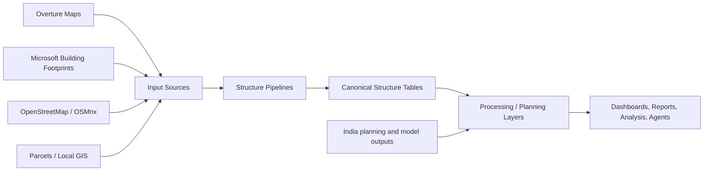
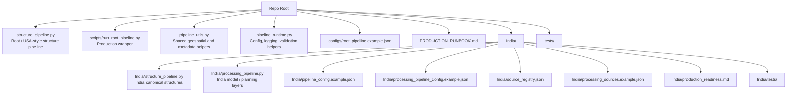
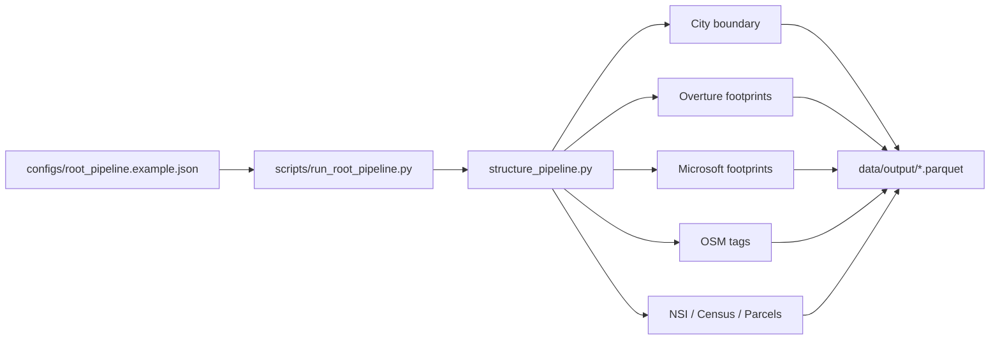
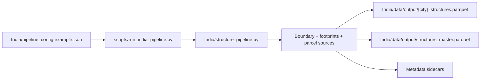
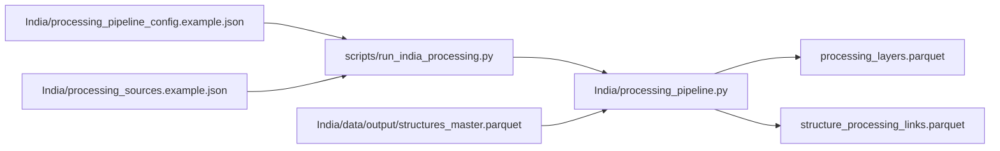
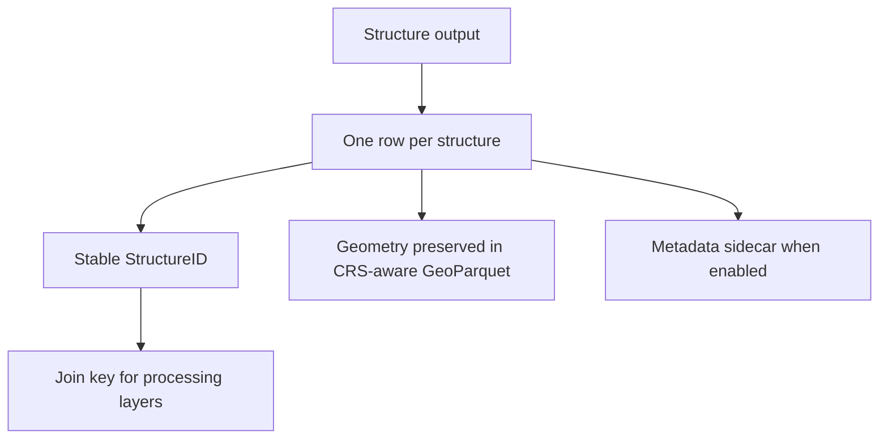

# Structures Repo Blueprint

This repo builds building and structure datasets from geospatial sources. It has a general root pipeline and an India-specific workflow for structure intelligence, processing layers, and downstream planning analysis.

## What This Repo Does



The main output is a structure-level geospatial table: one row per building footprint, with IDs and optional enrichment fields. The India workflow keeps structure data separate from model, planning, hazard, and deep-learning layers, then links those layers back to structures by `StructureID` or spatial relationship.

## Main Use Cases

- Build city-level building footprint datasets.
- Merge Overture, Microsoft, OSM, parcel, census, and optional source attributes.
- Produce a stable structure table for GIS analysis, dashboards, or downstream systems.
- Run India-specific city workflows with separate processing layers for segmentation, change detection, flood prediction, and urban planning context.
- Validate production-style runs with JSON configs and repeatable commands.

## Repo Map



## Pipeline Flow

### Root Structure Pipeline



### India Structure Pipeline



### India Processing Pipeline



## Key Files

| File | Purpose |
| --- | --- |
| `structure_pipeline.py` | Root structure pipeline. Builds enriched structure polygons from footprint and enrichment sources. |
| `India/structure_pipeline.py` | India-specific canonical structure pipeline. Defaults to India paths and disables US-specific NSI/census by default. |
| `India/processing_pipeline.py` | Separate India processing-layer pipeline for segmentation, flood, change detection, and urban planning outputs. |
| `pipeline_utils.py` | Shared helpers for slugs, geometry cleaning, CRS selection, metadata sidecars, and path/source utilities. |
| `pipeline_runtime.py` | Production execution helpers for config loading, logging, validation, and dry-run checks. |
| `scripts/run_root_pipeline.py` | Production-style wrapper for the root pipeline. |
| `scripts/run_india_pipeline.py` | Production-style wrapper for the India structure pipeline. |
| `scripts/run_india_processing.py` | Production-style wrapper for the India processing pipeline. |
| `PRODUCTION_RUNBOOK.md` | Short command reference for production-style runs. |
| `India/production_readiness.md` | India pipeline contract, validation expectations, and readiness notes. |
| `India/source_registry.json` | India source inventory and authority notes. |

## How To Use This Repo

### 1. Install Dependencies

Use the existing virtual environment if it already exists:

```bash
.venv/bin/python -m pip install -r requirements.txt
```

Optional India model-processing dependencies are listed in:

```bash
India/requirements-geoai.txt
```

### 2. Validate Configs Without Running

Dry runs validate config shape, logging level, dataclass fields, and protected paths.

```bash
.venv/bin/python scripts/run_root_pipeline.py --config configs/root_pipeline.example.json --dry-run
.venv/bin/python scripts/run_india_pipeline.py --config India/pipeline_config.example.json --dry-run
.venv/bin/python scripts/run_india_processing.py --config India/processing_pipeline_config.example.json --dry-run
```

### 3. Run The Root Pipeline

Edit `configs/root_pipeline.example.json`, then run:

```bash
.venv/bin/python scripts/run_root_pipeline.py --config configs/root_pipeline.example.json
```

### 4. Run The India Structure Pipeline

Edit `India/pipeline_config.example.json`, then run:

```bash
.venv/bin/python scripts/run_india_pipeline.py --config India/pipeline_config.example.json
```

### 5. Run India Processing Layers

First produce or provide `India/data/output/structures_master.parquet`. Then edit:

- `India/processing_pipeline_config.example.json`
- `India/processing_sources.example.json`

Run:

```bash
.venv/bin/python scripts/run_india_processing.py --config India/processing_pipeline_config.example.json
```

## Config Pattern

```json
{
  "logging": {
    "level": "INFO"
  },
  "places": [
    {
      "city": "Chennai",
      "state": "Tamil Nadu"
    }
  ],
  "config": {
    "country": "India",
    "strict_sources": false,
    "write_run_metadata": true
  }
}
```

Runtime validation rejects:

- unknown config fields
- missing or malformed `places`
- invalid logging levels
- paths pointing inside `.venv`

## Output Contract



The India structure pipeline writes canonical structures to `India/data/output/`. The India processing pipeline writes processing layers and structure links to `India/data/processing/output/`.

Do not commit generated raw data, caches, output tables, `.venv`, `__pycache__`, or notebook checkpoints.

## Development Checklist

Before trusting a change:

```bash
.venv/bin/python -c "import py_compile; py_compile.compile('structure_pipeline.py', doraise=True); py_compile.compile('India/structure_pipeline.py', doraise=True); py_compile.compile('India/processing_pipeline.py', doraise=True)"
PYTHONDONTWRITEBYTECODE=1 .venv/bin/python -m unittest discover -s India/tests
PYTHONDONTWRITEBYTECODE=1 .venv/bin/python -m unittest discover -s tests
```

For India changes, keep these docs aligned:

- `India/pipeline_change_log.md`
- `India/production_readiness.md`
- `India/source_registry.json`

## Mental Model

Use `structure_pipeline.py` or `India/structure_pipeline.py` to create the canonical building table. Use `India/processing_pipeline.py` only for model, hazard, planning, and other analytical overlays. Keep structure identity stable, keep raw inputs separate, and use JSON configs for repeatable runs.
